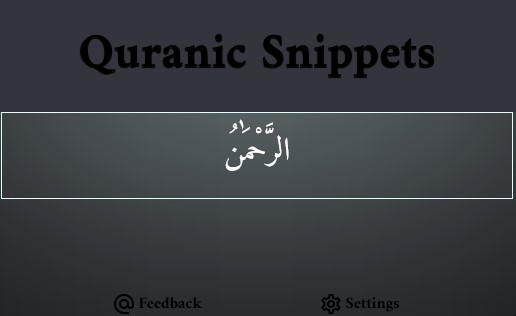
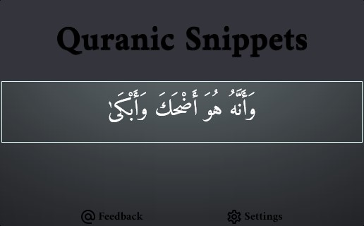

<h1>بسم الله الرحمن الرحيم</h1>

# Quranic-Snippets

A React Firefox extension that provides Quranic verses as snippets

## What does Quranic-Snippets do?

They say necessity is the mother of invention, I wanted an extension that provides me with bits from the noble Quran now and then, and when I couldn't find any already existing extensions that do that, I decided to make my own.

Right now, the extension provides a new random verse each hour.

## What features does Quranic-Snippets has?

-   A new random verse each hour, this period can be adjusted by the user. (Feature not ready yet)
-   Get more than one verse only, amount decided by the user. (Feature not ready yet)
-   Two languages interface, both in Arabic and in English. (Feature is ready)
-   The ability to get verses in either Arabic or English. (Feature not ready yet)
-   Bookmarking verses. (Feature not ready yet)
-   Read more about/More information about this verse type of feature. (Feature not ready yet)
-   Different colors and themes. (Feature might or might not come into being)

## How to use?

This extension will be available for free on the Firefox extensions store, but since it's not ready yet, see section below.

## How to use (currently):

Right now the extension isn't ready for the store just yet, I'm working on adding features and polishing things around but if you would like to test it locally, then follow those steps:

-   First off clone this repo.
-   Run, in your terminal, `yarn build` or `npm build`.
-   Open your Firefox browser, type in the address bar: `about:debugging`, this would open a settings web page, from there click on `This Firefox`.
-   After that, click on `Load Temporarily Add-on...`, you will be prompted to pick a file, navigate to the build folder inside the directory which you cloned and built this repo into, select `index.html` from the `build` folder.
-   You should see the extension in your Toolbar, left-click on it to interact with it.

## Why Quranic-Snippets?

I'm a person who's learning web development, so I thought why not make something useful while you are learning and also as I said, I wanted some sort of an extension that does what Quranic-Snippets do/will do. Also, I wanted to create something useful and meaningful, this extension and this project is and will always be free to use and for the sake of Allah, only thing you can do in return of using it is report bugs, request features and do Dua for me.
