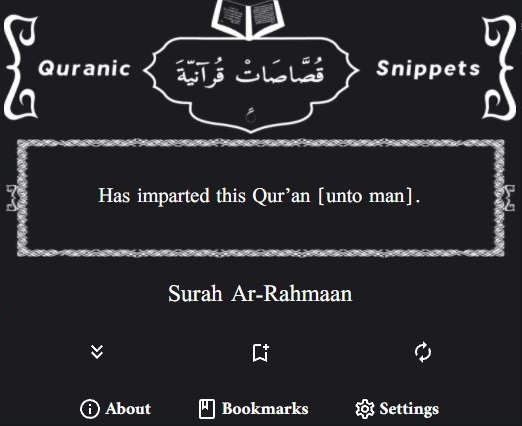

<h1>بسم الله الرحمن الرحيم</h1>

# Quranic-Snippets

A Browser extension that provides Quranic verses as snippets

## What does Quranic-Snippets do?

They say necessity is the mother of invention, I wanted an extension that provides me with bits from the noble Quran now and then, and when I couldn't find any already existing extensions that do that, I decided to make my own.

Right now, the extension provides a new random verse each hour.

## What features does Quranic-Snippets has?

-   A new random verse each hour, this period can be adjusted by the user, ranging from half an hour to 24h.
-   Two languages interface, either in Arabic and in English.
-   The ability to get verses in either Arabic or English.
-   Bookmarking verses.
-   Read more about/More information about this verse type of feature.

## How to use?

- You can download the extension for free from the [Firefox Addons Store](https://addons.mozilla.org/en-US/firefox/addon/quranic-snippets/).

- You can download the extension for free from the [Chrome web store](https://chrome.google.com/webstore/detail/quranic-snippets/ahahmhhkknhgobkknjlikglfnjgkfbod).

## Why Quranic-Snippets?

I'm a person who's learning web development, so I thought why not make something useful while you are learning and also as I said, I wanted some sort of an extension that does what Quranic-Snippets do/will do. Also, I wanted to create something useful and meaningful, this extension and this project is and will always be free to use and for the sake of Allah, only thing you can do in return of using it is report bugs, request features and do Dua for me.

## Contributors: 
- Project lead: [Yuniac](https://github.com/Yuniac).
- Design and artwork: [Harry](https://github.com/Haariz).

## Contributing:

As I said earlier this project is for Allah's sake and it's open source, feel free to clone this repo and do whatever changes you like/think are necessary and submit them in a PR.
